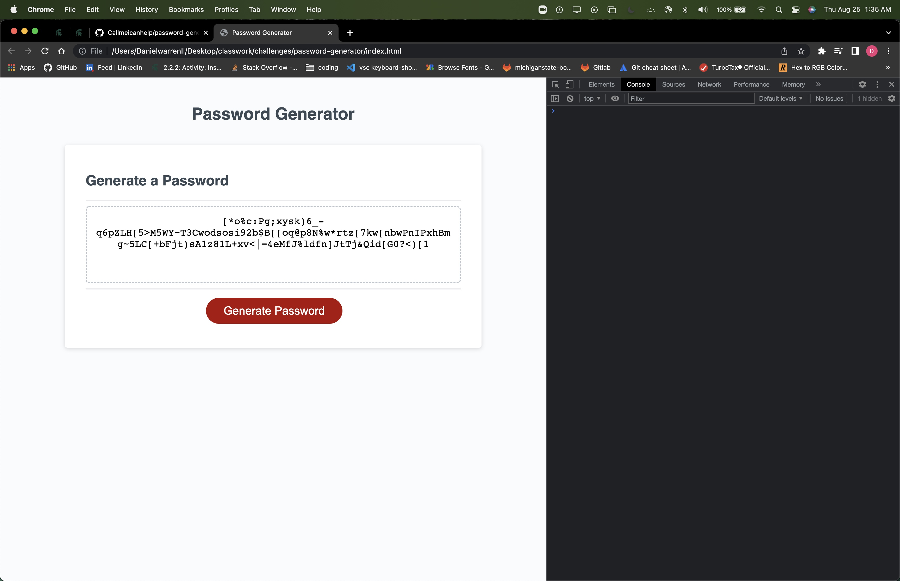

# password-generator

Randomized password generation.

Created on VS Code using javascript.

This app is used to generate a random password for our user when prompted for variables allowed to be used in the password, including upper and lower case letters, numbers, and some special characters.

GitHub deployed page: https://callmeicanhelp.github.io/SecureIT/

